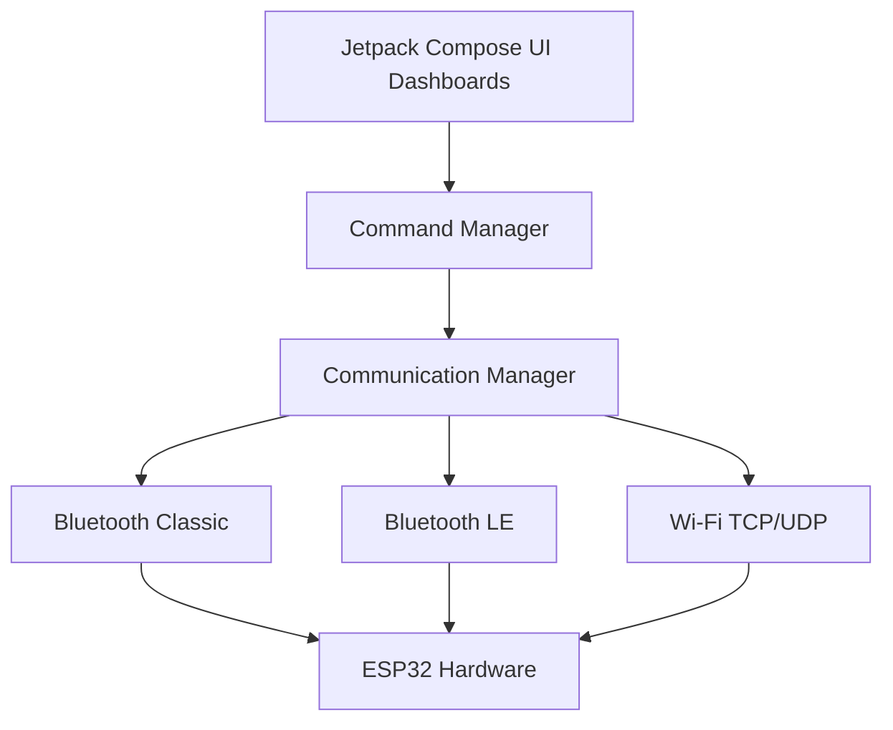

  

<h1 align="center">🚀 RC Link Pro</h1>

  <b>The Ultimate Universal Digital Transmitter for ESP32 & IoT Robotics</b>

  
  
  
  

---

## 🌟 Overview

**RC Link** is a premium, professional-grade Android controller application engineered to operate ESP32-based hardware, robotics, drones, and smart home automation systems. Featuring an ultra-realistic UI, glowing neon indicators, and tactile haptic feedback, it brings the physical feel of a high-end RC transmitter directly to your smartphone.

Whether you are communicating over **Bluetooth Classic, Bluetooth Low Energy (BLE), or Wi-Fi**, RC Link provides zero-latency command mapping and comprehensive live data monitoring.

---

## 🎮 Interactive UI Simulator

We've built a live web-based simulator so you can experience the professional grade RC Link Dashboard directly in your browser without installing the app!

  

*(To enable the simulator on your repo, go to **Settings > Pages**, set the source to `Deploy from a branch`, choose the `main` branch and `/docs` folder, and click Save!)*

---

## 📥 Direct APK Download

Click the button below to download the latest compiled Android Application directly.

  

> *Note: Make sure to allow "Install from Unknown Sources" on your Android device to install the application.*

---

## 🔥 Professional Features

### 📡 **Universal Connectivity Protocol**
- **Bluetooth Classic (SPP):** Standard seamless connection for classic HC-05/ESP32 serial ports.
- **Bluetooth Low Energy (BLE):** Low-power characteristic-based mapping for modern hardware.
- **Wi-Fi (TCP/UDP):** High-bandwidth local network connectivity for complex systems.

### 🎮 **Hyper-Realistic Dashboards**
Every project gets a specialized, ultra-responsive UI dashboard built with **Jetpack Compose**:
- 🏎️ **RC Car Controller:** Dual-joystick proportional steering with throttle gradients.
- ⚽ **Scrolling Ball Robot:** 3D drag-and-tilt virtual ball interface.
- 🚤 **Marine Boat Controller:** Nautical steering and throttle interface.
- 🚁 **Mini Drone Remote:** Professional transmitter style with distinct ARM/DISARM toggles.
- 💡 **Smart LED Hub:** Smooth PWM brightness sliders with RGB color-picking wheels.
- 🏠 **Home Automation:** Animated glowing toggle switches for smart rooms.

### 🎙️ **Voice & Text Command Engine**
- **Speech-to-Signal:** Map custom spoken phrases (e.g., `"Move Forward"`) directly to ESP32 bytes (`F`).
- **Live Terminal:** Monitor all `SENT` and `RECEIVED` data in a professional scrolling hacker-style console for easy hardware debugging.

### 🛠️ **Custom Controller Builder (Coming Soon)**
Drag and drop buttons, sliders, and joysticks to build your own perfect interface and map them to your hardware!

---

## 🏗️ Architecture

RC Link separates UI logic from hardware communication using a robust, highly modular architecture:

---

## 👨‍💻 Contributing & Development

This project is actively maintained. The codebase uses modern Android standards:
- **Kotlin 1.9+**
- **Jetpack Compose**
- **Coroutines & StateFlow**

*(c) RC Link Team - Designed for Robotics Engineers and Hobbyists.*
